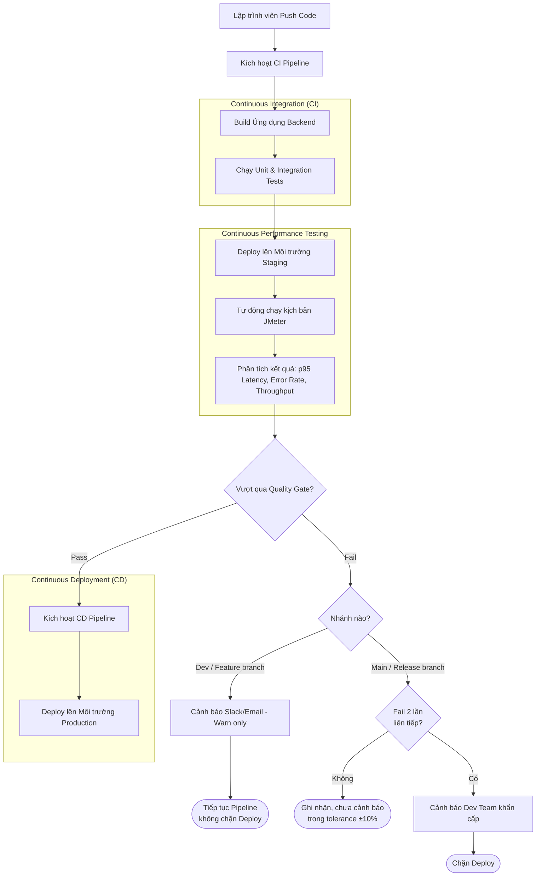

# Continuous Performance Testing Proposal (Task 3)

Để duy trì chất lượng hệ thống lâu dài, không thể chỉ test thủ công mỗi khi ra mắt tính năng mới. Thay vào đó, chúng ta cần tích hợp Performance Test vào đường ống CI/CD hiện tại. Dưới đây là mô hình Continuous Performance Testing đề xuất cho hệ thống EShop.

## 1. Mô hình hoạt động (Flowchart)

Mô hình sẽ theo dõi các Commit lên nhánh `main` (hoặc `release`) và tự động kích hoạt kịch bản kiểm thử hiệu năng nếu phát hiện có sự thay đổi trong code backend hoặc database schema.

## 2. Tiêu chí tự động quyết định (Decision Gates)
Hệ thống CI/CD sẽ dựa vào các thông số sau để tự động kết luận Pass hay Fail:
- **Ngưỡng độ trễ (Latency Threshold):** Độ trễ p95 của các API Auth-heavy không được vượt quá 500ms; Read-heavy không được vượt quá 200ms.
- **Tỉ lệ lỗi (Error Rate):** Tỉ lệ lỗi phải < 1% trong kịch bản Load Test.

## 3. Đánh giá Ưu đổi Nhược (Trade-offs)

Việc tự động hóa hoàn toàn Performance Test mang lại nhiều lợi ích lớn như phát hiện sớm nút thắt cổ chai (Shift-left testing), tuy nhiên cũng đi kèm các đánh đổi:

### Đánh đổi 1: Chi phí cơ sở hạ tầng (Cost) vs. Sự tự tin khi Deploy
- **Đánh đổi:** Để test Performance tự động, chúng bắt buộc phải duy trì một môi trường Staging có cấu hình (CPU/RAM/DB) giống hệt hoặc tương đương theo tỷ lệ chuẩn với Production. Việc giả lập hàng ngàn ảo người dùng (Virtual Users) cũng tiêu tốn tài nguyên máy chủ CI/CD đáng kể, làm tăng hóa đơn AWS/GCP hàng tháng.
- **Lợi ích:** Đổi lại, team Dev có sự tự tin tuyệt đối rằng bản cập nhật mới sẽ không làm sập server khi lượng người dùng tăng đột biến trong đợt Sale.

### Đánh đổi 2: Rủi ro Báo động giả (False Alarms) vs. Tính nhạy cảm
- **Đánh đổi:** Pipeline rất dễ bị Fail (Báo động đỏ) chỉ vì một biến động mạng nhỏ nhoi giữa máy chủ CI và máy chủ Staging, hoặc vì database chưa được clean-up kỹ lưỡng trước khi test. Nếu xảy ra False Alarms liên tục, team Dev sẽ sinh ra tâm lý "nhờn" cảnh báo (Alert Fatigue) và bỏ qua luôn các lỗi thật.
- **Giải pháp:** Cần thiết lập khoảng sai số (Tolerance Threshold) cho p95 (ví dụ: cho phép dao động 10%) và chỉ gửi cảnh báo nếu test Fail 2 lần liên tiếp. Thay vì block pipeline tức thì ở các nhánh Dev, chỉ cảnh báo (Warn), và chỉ thực sự Block ở nhánh Main/Release.